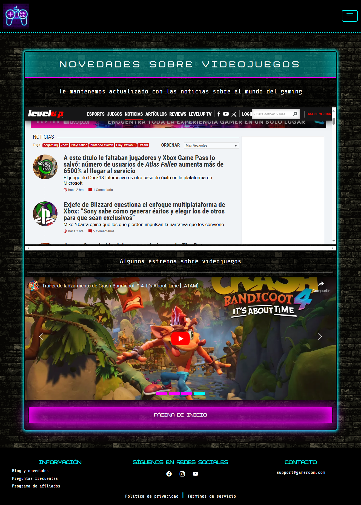

# Game Room


**Game Room** es una plataforma de mini videojuegos arcade, diseñada para ofrecer una experiencia de entretenimiento rápida y divertida. Esta aplicación frontend está construida con HTML, CSS, JavaScript, y Bootstrap 5, y contiene varias vistas esenciales para una experiencia de usuario fluida.

## Descripción

Game Room te permite acceder a una selección de mini videojuegos clásicos en un solo lugar. Con una interfaz intuitiva y fácil de usar, puedes iniciar sesión, crear una cuenta, explorar el blog, y mucho más.

## Vistas del Proyecto

Las vistas desarrolladas en **Game Room** incluyen:

- **Home:** Página principal donde los usuarios pueden explorar los juegos disponibles y obtener una vista general de la plataforma.

  

- **Login:** Formulario de inicio de sesión para usuarios registrados.

  

- **Signin:** Formulario de registro para nuevos usuarios.

  

  

- **Forgot Password:** Página para recuperar la contraseña de acceso.

  

- **FAQ:** Sección de preguntas frecuentes para resolver dudas comunes.

  

- **Blog:** Espacio para artículos y actualizaciones sobre la plataforma y los juegos.

  

- **Affiliates:** Información sobre el programa de afiliados.

  

- **Terms of Service:** Página con los términos de servicio que los usuarios deben aceptar.

  

- **Privacy Policy:** Página que detalla las políticas de privacidad de la plataforma.

  

## Tecnologías Utilizadas

- 

Para estructurar el contenido y las vistas de la plataforma.

- 

Para estilizar y mejorar la apariencia visual de la plataforma.

- 

Para agregar interactividad y dinamismo a las vistas.

- 

Para un diseño responsivo y componentes predefinidos que facilitan la creación de la interfaz.

## Instalación

Para clonar y trabajar con este proyecto localmente, sigue estos pasos:

1. Clona el repositorio desde GitHub:

   ```bash
   git clone https://github.com/Angelgdaniel/Game-Room.git
   ```

## Estructura del Proyecto

La estructura del proyecto se organiza de la siguiente manera:

- **index.html** - Página principal del proyecto..

- **css/** - Hojas de estilos CSS.

- **js/** - Archivos JavaScript para la funcionalidad dinámica.

- **fonts** - Fuentes tipográficas.

- **icons** - Favicon.

- **images** - Imagenes.

## Uso

Abre el archivo index.html en tu navegador para ver la plataforma Game Room en acción. Puedes navegar entre las distintas vistas utilizando los enlaces proporcionados.

## Contribuciones

¡Las contribuciones son bienvenidas! Si tienes sugerencias o encuentras algún error, no dudes en abrir un issue o enviar un pull request en GitHub.

## Licencia

Este proyecto está bajo la licencia [MIT](https://opensource.org/licenses/MIT).

### Contacto

---

Si tienes alguna pregunta o sugerencia sobre Game Room, no dudes en contactarme:

- Correo electrónico: angeldaniel.dev@gmail.com
